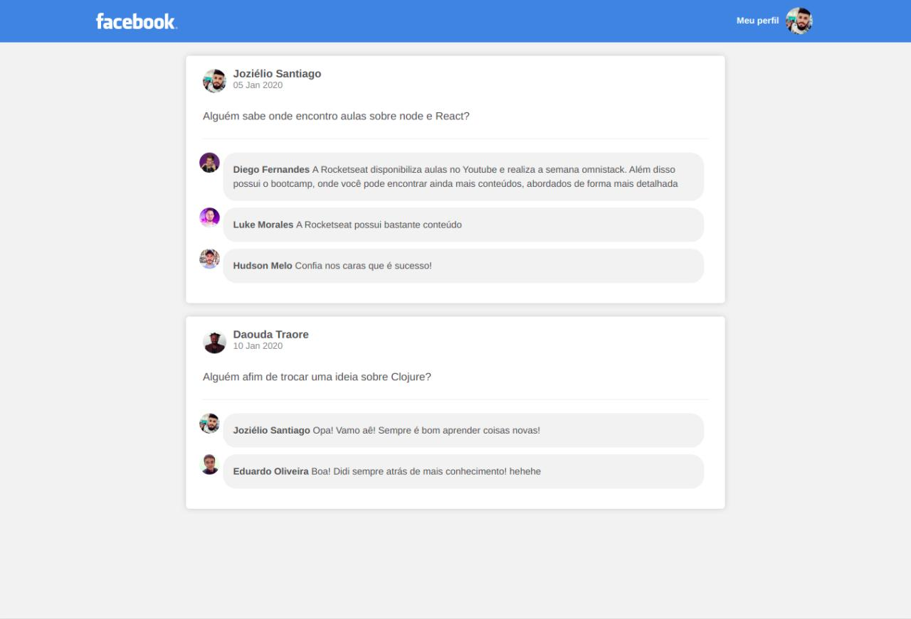

# Post List

O Post List é uma aplicação estática para exemplificar a criação de componentes em uma aplicação ReactJS. A página criada é semelhante a interface do facebook.




## Instalação

Após clonar o repositório, dentro da pasta criada, execute o comando

```bash
yarn
```

## Execução

Dentro da pasta do projeto execute

```bash
yarn start
```

## Licença
[MIT](https://choosealicense.com/licenses/mit/)
